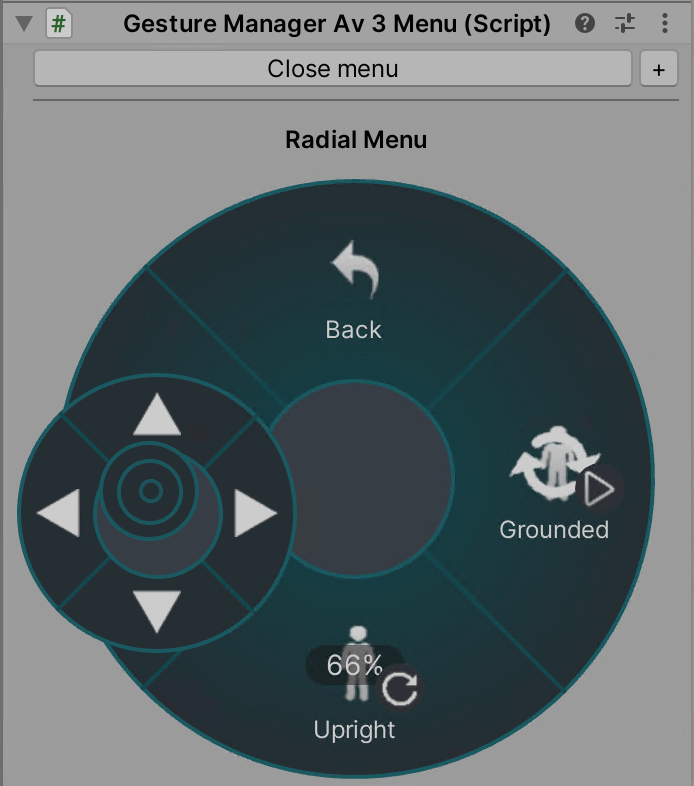

### New features in v 3.4.9:

3.4.9:

- Fix NaN error spam from eye look when using play unfocused (Thanks, d4rkpl4y3r)
- Add IsAnimatorEnabled and PreviewMode
- Looking up and down were flipped.
- Add IsAnimatorEnabled and PreviewMode
- Add "Have Eyes Follow Mouse" option in Settings (Thanks, jellejurre)

3.4.8:

- Do not overwrite eyes/eyelids and lipsync/jaw when TrackingControl is Animation
- Rotate eyes in local space (oops)
- Fix for Generic Avatars or when Head is null..

3.4.7:

- Fix non-local clone default parameters (Thanks, DorCoMaNdO)
- Add setting for force update colliders and disable by default to better emulate custom colliders from debug inspector (Thanks for the report, anatawa12)
- Implement eye look and blinking.
- Attempt to override viseme blend shapes in LateUpdate so they override animation.
- Fix parameter types being set wrong when mismatched between animators. (Thanks, jellejurre)
- Add GestureManager 3.9.3 support (Thanks, jellejurre)

3.4.6:

Thanks to jellejurre for their work in all of these changes.

- Also emit unsynced variables to OSC.
- If physbone/contacts are synced, dont set the access insts on remote #187
- Performance fix: Change default emulator settings to disable colliders from avatar descriptor.
- Use nullable lastValue instead
- Fix default parameter values not applied if they are 0 or false
- Add support for mismatched parameter Trigger types
- Support contact permissions

3.4.5:

- Remove use of dynamic completely, which should fix Av3Emulator on Android. Thanks, jellejurre.
- Allow selection of animator layers without selecting the animators in the projects panel. Thanks, nekobako
- Fix for mirror detection in animator start. Thanks, jellejurre
- Auto-select avatar by default. There is a setting to turn this off.
- Workaround VRCFury behavior causing the avatar to disable itself in play mode.

3.4.4:

- No longer force maxiumum version for VRCSDK
- Fix weird runtime build issue with IL2CPP and dynamic keyword
- Improve accuracy of mirror clone for mirror detection.

3.4.3:

- Add compatibility with GestureManager 3.8.9+

3.4.1 + 3.4.2:

- Fix editing float User Input.

3.4.0:

- Custom inspector! Special thanks to Dreadrith for the implementation, and to jellejurre for the integration.
- Fix for legacyFolders in the json. Thanks to anatawa12 for finding this.
- Implementation of VRCHeadChop. Thank you, jellejurre
- Implemented support for the VRCAnimatorPlayAudio state machine behavior. Thanks to jellejurre
- Convert negative values to true bool when casting parameter types.

3.3.1:

- Initialize on Start instead of Awake (thanks to jellejurre, anatawa12, bd_ and Senky for your guidance on this issue!)
- Add an option to use the old behavior of initialize on Awake. This shouldn't be needed, but if it fixes a glitch, let me know.
- Fix generic support (thanks, jellejurre)
- Fix scaling offset on parent constraints being wrong with changed scale (thanks, jellejurre)
- Fix bool copy parameter mismatch

3.3.0:

- Fix parametersIncorrect not working with null parameter.name (thanks anatawa12)
- Minimum support for `IsOnFriendsList`, false for local (thanks anatawa12)
- Implement preference for changing clones IsOnFriendsList
- Support latest Unity 2022 compatible version of SDK (thanks jellejurre)

3.2.4:

- Workaround bug in VCC that prevents installation.

3.2.3:

Thanks to anatawa12 for the update.

* Compatible with SDK 3.4.x
* Fix null check in preprocessAvatarCallbacks
* Enable avatar scaling by default. Thanks to Smash-ter for the report.

3.2.2:

Thanks to jellejurre for all of the hard work that went into this update.

* Av3Emulator is updated to latest SDK 3.3.0.
* Add head bone scale caching and stop unneeded scaling
* Refactor builtin parameters to SSOT and stop OSC from setting them
* Supress warnings if parameter is controlled by curve
* Enable parameter setting with OSC
* Add Parent Constraint scaling fix to follow VRC
* Add toggle to disable parent constraint offset scaling, and cloth fix
* Add safety checks for if internals change
* Warn only once when setting builtin parameters
* Include hidden parent constraints and enable scaling by default
* Avoid accessing PipelineSaver internal class.

### New features in v 3.2.1:

3.2.1:

* Av3Emulator is available in curated packages in VCC!
* Added credits, readme, github, version and changelog to the inspector.
* Introduce a OSC Control Panel window similar to the Settings window.
* Run preprocess hooks by default to make VRCFury testing easier.
* Create an emulator object from settings Apply button if one does not already exist.
* Disable GestureManager when creating an emulator object to avoid conflict.
* Make the settings window easier to use: Apply changes directly to the scene.
* Add avatar scaling support, with checkbox (Thanks, jellejurre)
* Add voice parameter functionality (Thanks, jellejurre)

### New features in v 3.2.0:

3.2.0:

* Av3Emulator is now available in curated packages in VCC!
* Updated version range to not downgrade VRCSDK below 3.3.x
* Show warning if GestureManager is enabled in the same scene. Fix some integration issues with GM 3.8.3 and higher.
* Do not clamp non-synced params. Internal cleanup with duplicate parameters
* Implement Settings page to save Default Settings. Add a button to set blendshape clamping.
* Add Earmuffs and VelocityMagnitude and freeze viseme when Mouth/Jaw animated
* Add localonly contact support
* Mitigation for both GestureManager and Av3Emulator in use in play mode.

3.1.4:

* Support for beta SDK 3.2.x including squish parameter.

3.1.2, 3.1.3:

* Fix uploading issue caused by VRCSDK reflection fix.
* Fix compatibility with VRCSDK <= 3.1.11
* Fix disable radial menu button

3.1.1:

* Fix error when DynamicBone is not present in project.
* Fix one cause of random bicycle pose when using experimental editor features. Thanks for reporting, DorCoMaNdO (Fixes #92 and #99)
  (In general, experimental features can lead to editor instability or crashes. Use at your own risk.)
* Deduplicate OSC warnings to avoid logspam. Thanks, Razgriz (Fixes #74)
* Allow emulating avatars in additively loaded scenes (PR #73). Thanks, SenkyDragon.

3.1.0:

* Make clone offset purely visual (from preCull until postRender). This may make testing network sync with contacts easier.
* Perform conversion of DynamicBone for legacy avatars that still use them.
* Implement descriptor colliders & senders emulation. Thanks, Dreadrith.
* Add local expression parameter support
* Add option for default poses. Thanks, Dreadrith.
* Add direct syncing between local and shadow/mirror clone. OSC now only initializes once.
* Performance optimizations for update loop. Thanks, jellejurre.
* Add renderer caching, fix skinned renderer mirror/shadow toggles. Thanks, jellejurre
* Compatibiltiy with GestureManager 3.8.3 only. Will enable GM menu by default if installed.

### New features in v 3.0.1:

3.0.1:

* **If you import this package, it will import to the Packages folder. If you have the old (Assets folder) version, delete it or you won't have access to the new features.**
* Finally, VPM support for VRChat Creator Compnaion! Thanks to jellejurre and anatawa12 for your hard work in making this happen!
* Added VCC/VPM Support.
  * This means added compatibility with the VCC GestureManager, but removed compatibility with the pre-VCC GestureManager.
  * You can still import the unitypackage as usual, but it will be unpacked to the Packages folder, not the Assets folder.
  * You can also copy the created lyuma.av3emulator folder to another location, add that folder to the VCC in the settings menu, and install the emulator with a single click for any of your other projects.

* Installs in Packages with unique GUIDs. you are free to remove the old Lyuma/Av3Emulator directory after upgrading.
* Fixed the wrong guid being used for the Action controller. Thanks, ShingenPizza.
* Generate AvatarMask in code instead of using assets.
* Implement parameter mismatch, so bool parameters can be coerced into floats, for example for usage in blend trees.
* Added rich text support for VRCExpressionMenus in the simple parameter menu.
* Fixed one instance of "Can't remove component" error appearing when filtering components to emulate shadow and mirror clones.
* Fixed mirrorclone and shadowclone having IsLocal set to false.

3.0.0:

* A merge commit was lost, so some of the above bugfixes were missing. Please use 3.0.1 instaed.

### **New features in v 2.9.12:**

Old 2.9 versions are available in the **legacy-emulator-v2.9** branch.

2.9.12:

**This will likely be the last and final non-VPM release in the 2.9 series.**

You are encouraged to install the 3.0 release, which includes VPM support (for VCC), and installs into the Packages directory.

Version 3.0 should work even in a non-VCC project, but I am releasing this version in case some people still wish to avoid this change.

Cherry-picked useful changes from 3.0. Thanks, Shingen, jellejurre, anatawa12 and Dreadrith for your help!

* Fixed GUID for Action playable layer.
* Generate AvatarMask in code instead of using assets.
* Implement parameter mismatch, so bool parameters can be coerced into floats, for example for usage in blend trees.
* Rich text support for simple parameter menu.
* Filter components to more accurately emulate shadow and mirror clones.

### **New features in v 2.9.11:**

2.9.11:

* Updated for new GestureManager.
* Support sending and recieving avatar dynamics over OSC.
* Support receiving in-game input (velocity, etc.) from OSC. Thanks, NotAKidOnSteam.
* Can also test loopback using same send and recieve port. Enable Gizmos in Game View toolbar.
* Add checkbox to enable Avatar Preprocess hooks. Thanks, bd_. May interfere with the first clone.
* Fix for new FX mask behavior. Thanks, Mysteryem.
* Attempt to mitigate default mask and controllers from Creator Companion SDK.

### **New features in v 2.9.10 (3.0 rc7):**

2.9.10:

* Fixed legacy menu being completely broken.
* Fixed ParameterDriver Copy when setting float parameters.
* Made ParameterDriver Copy set boolean to true if negative, to match docs.
* Allow dragging Expression Value in the Floats section of the inspector.
* In the Floats section, "Value" will show the animated Animator parameter (if driven by curve) which may be different from the expression value which is used for sync and parameter driver Copy.

### **New features in v 2.9.9 (3.0 rc6):**

2.9.9:

* **Requires SDK VRCSDK3-AVATAR-2022.06.03 or newer** Please update the SDK if it is before June 2022.
* Added support for the new Copy parameters feature.
* Bifurcate exported and internal float values to avoid pollution from AAPs. This should match game better, as you cannot sync an AAP value over the network.
You will not see `exportedValue` and `value` sliders for floats. Value will represent what the Animator sees, while Exported represents the value which is synced (and used for parameter Copy).
* Please let me know if there are bugs related to the bifurcated float parameters.
* Make buttons compact by default to avoid issue with huge buttons.
* Remove use of Reflection, as we are breaking compatibility with older VRCSDK versions.

### **New features in v 2.9.8 (3.0 rc5):**

2.9.8:

* Upgrade GestureManager to version 3.4 in the .unitypackage build. Some constructor arguments changed, so be sure to upgrade both.
* Allow all parameter types for contacts, Strech, IsGrabbed and Angle. (Thanks, bd_)
* Fix for non-local clones and reduced logspam (Thanks, bd_)
* Fix animated animator parameters (AAP) support for Debug Duplicate Animator.
* Ensure animator window is refreshed when switching Debug Duplicate Animator.
* Fix possible bug when using Default Animator to Debug in emulator control.

Using reflection, the emulator continues to be compatible with older pre-physbone SDK versions. This may be the last version of Av3Emulator supporting older SDKs.

**Avatar Dynamics integration (read NOTE)**

Latest VRCSDK provides Avatar Dynamics support built-in.

**NOTE**: To test Avatar Dynamics, you must have a **Camera** in your scene **tagged as "Main Camera"** (top of the inspector next to the layer dropdown).

To test, you must be in **Game View**. Make use of _GameObject menu -> Align With View (Ctrl+Shift+F)_ for easily copying the Scene View to your camera transform.

This update hooks into the driven parameters on both `PhysBone` and `ContactReceiver`. Enabled by default. Can be disabled by ticking a box on the Emulator Control before entering play mode. Recommended to set Radius greater than 0.

For non-open beta, now supports hot reloading scripts without restarting play mode. This can be useful for rapid testing.

**OSC Now works in the emulator (opt-in)**: Supports sending and receiving OSC messages for your avatar. Off by default. Simply tick "**Enable Avatar OSC**" to turn it on.

Supports generating, loading and saving JSON config files for OSC for use in VRChat.

**Compatible with VRCFaceTracking**. Avatar switch messages are now implemented! Messages are sent without bundles for compatibility.

Other features:

* Checks for PipelineSaver component: No longer should block upload.
* GestureManager menu is now off by default, and easy to switch on and off as needed.
* No longer crashes when some animators are set to null or VRCSDK is installed in the wrong place.
* Try to reduce inspector bouncing while navigating menu.
* Added new Jump box to simulate a jump (grounded, up velocity, down velocity). Also supported from OSC.
* Improved a bunch of bugs with Mirror and Shadow clones thanks to 3. They can be disabled by clicking the boxes in the main Emulator Control.
* Merged in contribution by 3 to support head scaling.
* Support for IK Sync to local clones.
* Many more bugfixes.

### **New features in v 2.9.7 (3.0 rc4):**

2.9.7: Fix VRCPhysBone and ContactReceiver components disabled by default.

2.9.6: Mostly a stability update to fix common issues with running the emulator.

Grabbing and posing should work more reliably now. Make sure not to leave your bone Radius at 0.

* Made AvatarDynamics parameters more strict to match VRC implementation, so float params must be float; bool params must be bool, and so on.
* Fixed issues with grabbing and posing bones.
* Fixed more build errors.
* Fixed grabbing bones not working when the OSC folder was missing.
* Added some try/catch for exceptions related to the OSC folder in LocalLow.

2.9.5: Fixed Build and Publish AGAIN.

### **New features in v 2.9.0 (3.0 beta):**

**Release note**: Lyuma's Av3 Emulator now comes in two versions: lite/classic version with a basic menu; and the other which includes VRC-Gesture-Manager and the radial menu.

 

* New! Integration with the Avatar 3.0 Menu when [VRC Gesture Manager by BlackStartx](https://github.com/BlackStartx/VRC-Gesture-Manager) is installed.
* Support for MirrorReflection duplicate with only FX playable (can choose which version to show/hide).
* Attempt to emulate the uninitialized state for remote players.
* Add a "update interval" to simulate network delay when sending parameters.

* FIXED: Default layer weights were being ignored. Unity defaults layers to weight 0, and this should make such mistakes easier to catch.
* FIXED: Add ParameterDriver was failing half the time.
* FIXED: AngularY float range to match smooth turn in VR (by NotAKidOnSteam)
* FIXED: GestureWeight is always 0 for neutral; always 1 for most gestures, and only varies from 0 to 1 for Fist.
* FIXED: Local player bounds forced to update when offscreen; and animator culling turned off.

Known issues: Edit Mode in radial menu does not work

As always, watch out for mistakes with Write Defaults. Also, while animating your own avatar might work for you, it may break the avatar for remote players in game: this cannot be perfectly replicated in editor.

### **New features in v 2.2.2:**  
* Fix max value for random int, for example used in ragdoll system (Thanks, ksivl)
* Fix crash when emulator is enabled and exiting play mode (Thanks, ksivl)
* Made a further attempt to mitigate interfering with the upload process if a PipelineSaver component is present.

### **New features in v 2.2.1:**
* Fix off-by-one errors with layer and playable weight changes
* Fix bugs with layer control behaviours
* Fixed saved parameters. They were broken in the last update.
* Added AvatarVersion variable, set to 3 in debug inspector.
* Allow testing IKPose and TPose calibration.
* Force exact path for default controllers from VRCSDK to avoid finding edited duplicates.
* Reduce logspam from parameter drivers.

### **New features in v 2.1.1:**
* Supports new features in VRChat 2021.1.1
* Expression menu support for Bool and Float toggles and submenus, in addition to existing support for Int.
* Removed support for Parameter Drivers from sub-animators, to match ingame. Use a checkbox on the "Avatar 3.0 Emulator" control object to re-enable the legacy behavior for nostalgia sake, I dunno.
* To test saving, there is a checkbox (on by default) which keeps saved parameters when the avatar is reset.
* Supports synced bools and triggers same as ingame. The rules for "Add" and "Set" operations are different for bools and triggers in expression parameters and those not. See below for the rules.
* Fixed issues with 8-bit float quantization. Should now match serialization in-game. Quantization of floats is now off by default except if you check the "Locally 8-bit quantized floats" box or make a non-local clone.
* *What is quantization?* Basically, 0.5 locally is not 0.5 for other users. You should not assume floats are sent precisely over the network. A float is serialized into a value between -127 and 127, and deserialized back to -1.0 to 1.0 range. Only -1.0, 0.0 and 1.0 are sent precisely over the network.

Not implemented: saving and loading saved expression parameters. Parameters are lost every time you enter play mode.

### **New features in v 2.0.0:**
* **Animator To Debug** dropdown has been fixed. View your animator in action in the Unity Animator window, and update parameters in real time.
* The **Lyuma Av3 Menu** component allows using your avatar's expression menu actions directly from the editor. Click + to open two radial menus at once to test combining puppets. (Thanks to @hai-vr for the contribution!)
* Support for testing Visemes.
* Support for the Is VR checkbox, tracking type and more. (Thanks to @hai-vr for the contribution!)
* Basic support for Generic avatars.
* After using **Tools** -> **Enable Avatars 3.0 Emulator**, set default VR tracking type and other settings by selecting the **Avatars 3.0 Emulator Control** object before entering Play Mode.

