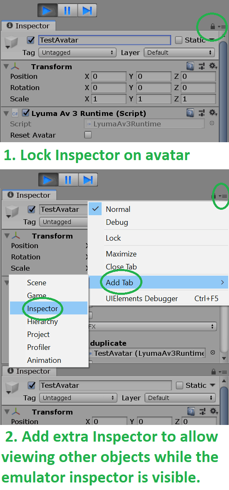
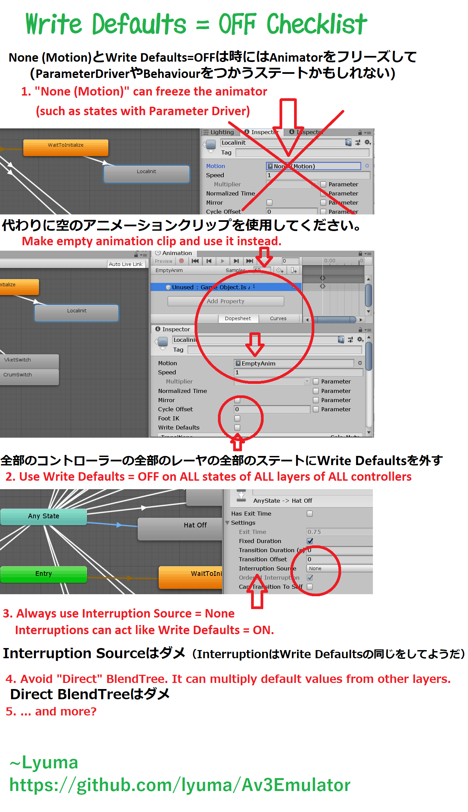

# Avatar 3.0 Emulator

## **[Download the latest version at: https://github.com/lyuma/Av3Emulator/releases](https://github.com/lyuma/Av3Emulator/releases)**

[See the CHANGELOG](CHANGELOG.md)

### **About the Avatar 3.0 Emulator:**

What is Avatars 3.0? Read the VRChat documentation here: https://docs.vrchat.com/v2020.3.2/docs/what-is-avatars-30

This is an emulator for Avatars 3.0 reimplemented in the unity editor on top the the unity [PlayableGraph](https://docs.unity3d.com/Manual/Playables-Graph.html) API, using the [AnimationControllerPlayable](https://docs.unity3d.com/2018.4/Documentation/ScriptReference/Animations.AnimatorControllerPlayable.html) and [AnimationLayerMixerPlayable](https://docs.unity3d.com/2018.4/Documentation/ScriptReference/Animations.AnimationLayerMixerPlayable.html) APIs.

## Av3 Emulator Overview:

[(Open the above full explanation image)](Runtime/Screenshots/avatar3emu_tutorial.png)

## Features:
* Should emulate most features of Avatar3.
* Test non-local syncing by duplicating or clicking the "Create Non Local Clone" checkbox.
* Supports live viewing and editing within unity's Animator window! Use the "Animator To Debug" dropdown to select which layer is visualized in the Animator window.
* Shows Tracking/Animation in the inspector.
* Gesture left/right weight to test analog Fist gesture strength.
* Custom Expression Menus
* Supports viewing and editing float and int paramters, view the Expression Menu, via Parameters tab of the Animator window, via the blend tree input, via Parameter Driver, or manually, by alt-clicking the ▶Floats and ▶Ints headers at the bottom of the Lyuma Av3 Runtime script.
* Visemes for both parameters and testing builtin blend shapes (note: visemes always set to 0% or 100%, not in between.)

## Not implemented/todo:
* Custom inspector
* visualization of IK Tracking state when a limb is not in Animation mode.
* Eye Tracking / Blinking support is not implemented.
* Set View position not fully implemented.

## How to use the Av3 Emulator:

Go to the **Tools** menu, and select **Avatar 3.0 Emulator**.
This will add an object to your scene: you can always remove it if you don't want it to run. Use this object to set default VR mode, tracking type or Animator to Debug settings. Let me know if other settings would be useful here.

To emulate walking and movement, click the avatar and scroll down the inspector to the bottom section with Lyuma Av3 Runtime component. Here you can change stuff.

It also supports live interacting with the animator controller. To use this, first click your avatar (even if it was already selected), and then open up **Windows** -> **Animation** -> **Animator** ; and pick the controller using "**Animator To Debug**" dropdown. You can also change parameters from inside the controller, for example moving the red dot in the 2D Blend Tree for Standing. Crouch/Prone by changing the Upright slider; or test Sitting or AFK.

If you wish to emulate walking, you can also do this by selecting Base layer, opening up the Locmotion controller with your avatar selected, and going to the Standing blendtree and dragging around the red dot.

## NOTE: about viewing animator state from layers other than Base/locomotion:
The avatar should behave correctly when "Animator to Debug" is set to Base. When you pick another layer, for example FX, the *output* of the animator may differ slightly. For example, Direct BlendTrees with non-zero initial outputs may produce different results. Also, the whole playable weight may be forced to 1 on the debugged animator.

Another useful tool is the "PlayableGraph Visualizer" which can be found in the unity Package Manager (Advanced -> Show preview packages). It is hard to use, but does a good job of visualizing clip, layer, and playable weights.

## Inputing custom stage params:

Use the expression menu under the **Lyuma Av3 Menu** header, or the Parameters tab of the Animator window, after selecting your layer as **Animator To Debug** in the inspector.

For manual control, you can also alt-click the Floats and Ints sections at the bottom of the Lyuma Av3 Runtime script to expand them all, and change the values from there.

## Notes about Set, Add ( blank ) and Random operations for boolean and trigger parameters.

For **Bool and Trigger values not set in expression parameters**, the rules are straightforward:

* Unsynced Bool Set: sets to true if Value is checked
* Unsynced Bool Random: sets to true if RAND() < Chance, false otherwise
* Unsynced Bool Add: sets to true if Value != 0.0 in debug inspector
* Unsynced trigger Set: sets unconditionally
* Unsynced trigger Random: sets if RAND() < Chance
* Unsynced trigger Add: sets unconditionally

(Note that "Add" shows up as a blank dropdown. Unlike the inspector, Add uses the Value instead of the Chance field. You need to check the debug inspector. Also, there is no point in using "Add" in this case, so just fix it if you see a blank dropdown.)

*HOWEVER*, For **Bool values set in expression paramters**, there is a notable difference in the case of the "Add" (blank) operation:

* Synced Bool Set: sets to true if Value is checked
* Synced Bool Random: sets to true if RAND() < Chance, false otherwise
* Synced Bool Add: sets to true if (Value + (currentValue?1.0:0.0)) != 0.0; sets to false otherwise

Using Add (blank dropdown) with a Value of -1.0 (in the debug inspector or using "Set" first), it is possible to make a toggle operation, but only for Bool values in your expression parameters.

Finally, Triggers set in expression parameters act completely unintuitively. **AVOID USING PARAMETER DRIVERS ON TRIGGER PARAMETERS SET IN EXPRESSION PARAMETERS!!!** Still, if you are interested, here are the rules for synced Trigger parameters:

* Synced trigger Set: Uses the Value in the Debug inspector. sets to true if Value != 0.0; sets to false if Value == 0.0; does not set trigger if set to 0.0 by next frame.
* Synced trigger Random: sets if RAND() < Chance, false otherwise
* Synced trigger Add: sets to true if (Value + (currentValue?1.0:0.0)) != 0.0; sets to false otherwise; does not set trigger if set to 0.0 by next frame.

Synced Trigger parameters remember if they were set to true, and will only set again if explicitly set to false and then true again.

## Other known issues:

The `proxy_` animations included in the SDK are incomplete. Unless you override them, do not expect your avatar to have a full walking cycle, and it is normal for backflip (VRCEmote=6) to stop halfway.

If you're having unexplained issues, they might happen in game too. The most common cause is due to Write Defaults being turned on in one or more states, in any layer, in any controller. You must have Write Defaults OFF **everywhere** to ensure proper operation 100% of the time. Please see the guide below.

## Helpful guides

[(View full lock inspector explanation)](Runtime/Screenshots/lock_inspector_tutorial.png) [(View full write defaults off checklist)](Runtime/Screenshots/write_defaults_off.png)

# Thanks

Although this is known by and released under my name Lyuma,
it is only thanks to all of you in the community using and supporting the project,
and for the many contributors that Av3Emulator is what it is today. <3

Special Thanks to

* jellejurre for maintaining the package and making tons of amazing changes
* anatawa12, Dreadrith, bd_, Mysteryem, NotAKidoS for continued changes and support
* hai-vr for the original menu implementation, testing and support
* BlackStartX for GestureManager
* VRC Shader Dev, VRLabs, Invitation, VRCPrefabs communities and more for all the support.
* and the V-Sekai team for contributions, inspiration and keeping me going through the years.
